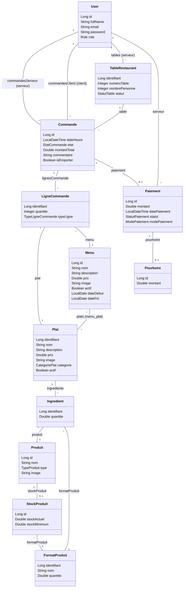
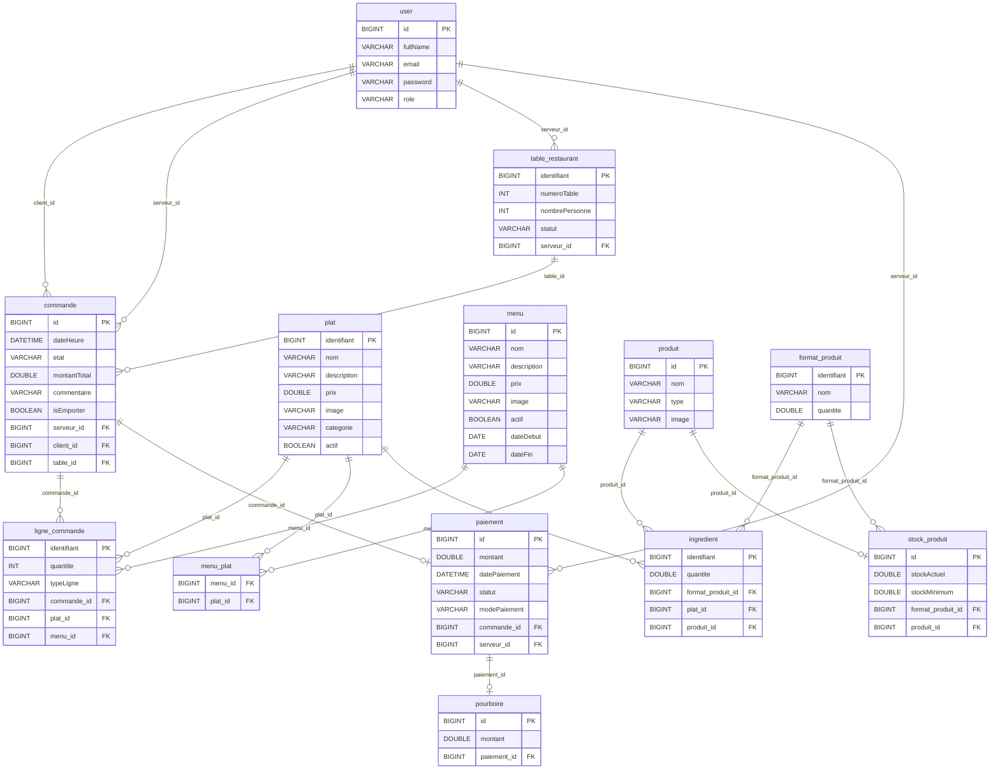

# 🍽️ RestoManager - Logiciel SaaS de Gestion de Restaurant

**RestoManager** est un logiciel SaaS complet (POS / ERP) conçu pour la gestion optimisée des restaurants. Il intègre la prise de commande, la gestion des stocks en temps réel et propose une interface multi-rôles adaptée à chaque membre du personnel (Administrateur, Chef Cuisinier, Serveur, Client).

## 🚀 Stack Technique
* **Backend :** Java, Spring Boot
* **Frontend :** Thymeleaf, Bootstrap 5.3.3, Bootstrap Icons (CDN)
* **Base de données :** MySQL (H2 en mémoire pour l'environnement de test)
* **ORM :** Spring Data JPA / Hibernate

---

## 📊 Diagramme de Classes (UML)

---

## 🗄️ Schéma de la Base de Données (ERD)

---

## 🛠️ Règles Métier (Business Rules)

Le système implémente une série de règles métier strictes pour assurer un fonctionnement optimal du restaurant.

### 🔄 Le Cycle de Vie d'une Commande
Le flux d'une commande évolue à travers plusieurs statuts clés (`EN_ATTENTE`, `EN_PREPARATION`, `SERVIE`, `PAYEE`) de façon à synchroniser le travail entre la salle et la cuisine.
- Les commandes des clients (depuis la salle) initient le flux avec un statut `EN_VALIDATION` nécessitant l'approbation du serveur.
- Une fois confirmée, la commande passe `EN_ATTENTE` pour alerter le Chef.
- Tout ajout d'articles à une commande déjà `EN_PREPARATION` ou `SERVIE` réinitialise son statut à `EN_ATTENTE` pour notifier la cuisine de la modification.
- Le cycle se conclut lorsque la commande est `PAYEE`.

### 🪑 Gestion "Sur place" vs "À emporter"
Le système découple logiquement la commande de la table physique.
- L'attribut `isEmporter` sur l'entité `Commande` permet de libérer la contrainte relationnelle avec `TableRestaurant` (qui devient optionnelle / nullable).
- Les commandes à emporter bypassent l'étape `EN_VALIDATION` et sont envoyées directement en cuisine (`EN_ATTENTE`).

### 📦 Gestion intelligente des Stocks
La gestion des stocks repose sur une standardisation des unités.
- L'entité `FormatProduit` normalise les mouvements (ex: L, kg, unités).
- Les mouvements d'Entrées/Sorties permettent une gestion fluide en nombres entiers (grâce aux formats).
- Les ingrédients consommés (via la commande de Plats et Menus) sont déduits dynamiquement et précisément des stocks selon leurs formats respectifs.

### 🗑️ Menus Éphémères (Soft Delete)
Afin de préserver l'intégrité historique (facturation, statistiques), la suppression physique n'est pas utilisée.
- L'attribut `actif` permet d'archiver "logiquement" (soft delete) les Plats et Menus.
- Les Menus incluent des dates de validité (`dateDebut`, `dateFin`) idéales pour les offres saisonnières ou éphémères.
- Ces mécanismes évitent de polluer la carte présentée aux clients et serveurs, tout en gardant une traçabilité comptable parfaite.

### 💸 Encaissement & Pourboire
La facturation inclut des fonctionnalités modernes adaptées à la restauration.
- Un module QR Code simule le paiement final de façon autonome, sans requérir de TPE ou de service externe comme Stripe, simplifiant l'intégration locale.
- Le Grand Total est calculé dynamiquement en y intégrant un potentiel `Pourboire` facultatif, garantissant que la facturation globale concorde avec le paiement effectif du client.

---

## 🔐 Rôles et Accès

Le contrôle d'accès est garanti par Spring Security (`@PreAuthorize`, etc.), redirigeant et restreignant les affichages dynamiquement selon les rôles.

| Rôle | 👤 Actions & Visibilité | Dashboard |
| :--- | :--- | :--- |
| **ADMIN** | Gestion complète. A accès à la configuration des tables, au stock, à la création de Plats/Menus et au Dashboard global. | `/admin/dashboard` |
| **CHEF_CUISINIER** | Vue sur les commandes `EN_ATTENTE` et `EN_PREPARATION`. Peut modifier l'état des commandes et consulter les stocks. Accède à l'administration de base (Plats/Menus). | `/orders/chef-dashboard` |
| **SERVEUR** | Création et prise de commande POS. Approuve/Gère les commandes des clients, attribue et gère le statut des tables. Procède aux encaissements. | `/orders` |
| **CLIENT** | Simulation et passation de commandes autonomes à table. Paye via son application. Accès limité à son propre panier et historique. | `/client/dashboard` |
